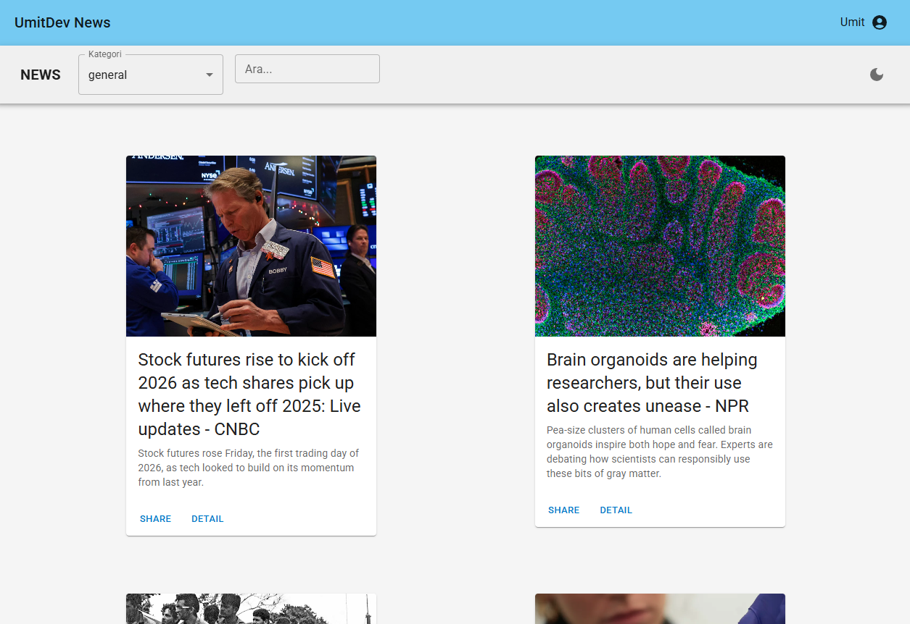
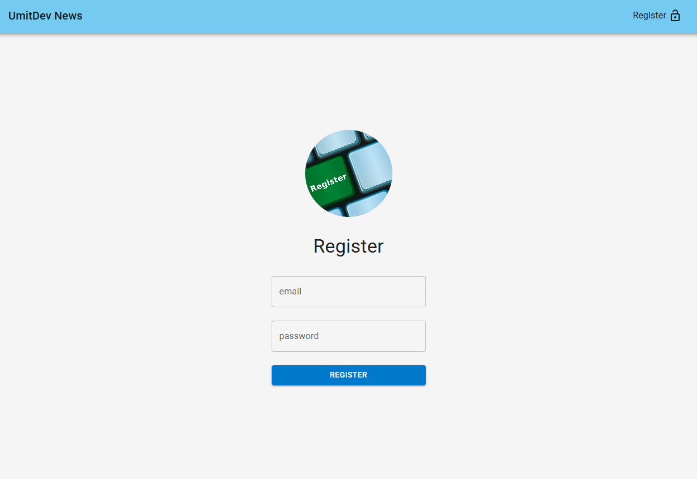
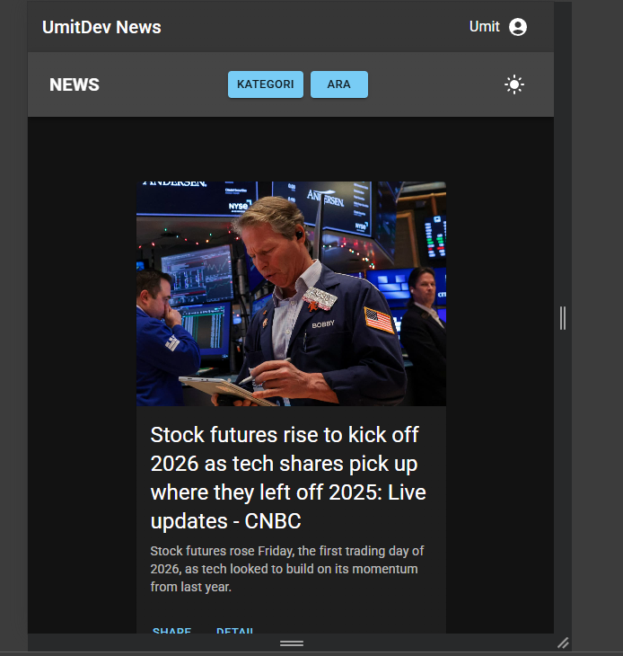

<h1 align="center">📰 React Firebase News App</h1>

<div align="center">
  <h3>
    <a href="https://news-v2-umitdev.netlify.app/">
      🖥️ Demo
    </a>
     | 
    <a href="https://github.com/Umit8098/React-Project-11.3-news-API-netlify.git">
      📂 Repository
    </a>
  </h3>
</div>

<p align="center">
  
</p>

## 📚 Table of Contents

- [📚 Table of Contents](#-table-of-contents)
- [✨ Overview](#-overview)
- [📖 Description](#-description)
- [🚀 Features](#-features)
- [🗂️ Project Skeleton](#️-project-skeleton)
- [🛠️ Built With](#️-built-with)
- [⚡ How To Use](#-how-to-use)
- [🔐 Firebase \& Netlify Notes](#-firebase--netlify-notes)
- [📌 About This Project](#-about-this-project)
- [🙏 Acknowledgements](#-acknowledgements)
- [📬 Contact](#-contact)

---

## ✨ Overview

<div align="center"> 

  
  
  --- 
  
   

  ---
   

  ---
  

  ---

</div>

---

## 📖 Description

🔸 **React Firebase News App**, modern frontend teknolojileri kullanılarak geliştirilmiş bir **haber uygulamasıdır**.

🔸 Kullanıcılar:
  * Email / Password veya Google ile giriş yapabilir
  * Korumalı route’lar sayesinde yalnızca giriş yaptıktan sonra haberleri görüntüleyebilir
  * Kategoriye göre haber filtreleyebilir
  * Anahtar kelime ile haber araması yapabilir

🔸 Haber verileri **NewsAPI** üzerinden alınır.

🔸 🔐 API Key güvenliği için:
  * API çağrıları **Netlify Functions** üzerinden yapılır
  * Client tarafında API Key **asla açığa çıkmaz**

🔸 🌙 Dark / Light Theme desteği Redux Toolkit ile yönetilmektedir.

🔸 Proje boyunca:
  * Clean code
  * Component-based mimari
  * Modern React best practice’leri
hedeflenmiştir.

---

## 🚀 Features

* 🔐 **Firebase Authentication**
  * Email / Password Login
  * Google Sign-In
  * Forgot Password
* 🛡️ **Protected Routes**
  * Login olmadan `/` (News) erişimi yok
* 📰 **News Listing**
  * NewsAPI entegrasyonu
  * Category filtering
  * Keyword search
* 🌐 **Netlify Functions**
  * API Key gizleme
  * Serverless backend
* 🧠 **Redux Toolkit**
  * Auth state
  * News state
  * Theme state
* 🌗 **Dark / Light Mode**
  * Redux + MUI ThemeProvider
  * Kullanıcı tercihi Local Storage’da saklanır
* 📱 **Responsive Design**
  * Mobil & Desktop uyumlu
  * Mobil için modal tabanlı search & category
* 🎨 **Material UI (MUI)**
  * Modern ve tutarlı UI
* 🚀 **Netlify Deployment**
  * SPA routing desteği
  * Environment variable yönetimi

---

## 🗂️ Project Skeleton

```
src/
│
├─ app/
│ └─ store.js
│
├─ components/
│ ├─ Navbar.jsx
│ └─ Header.jsx
│
├─ features/
│ ├─ authSlice.js
│ ├─ newsSlice.js
│ └─ themeSlice.js
│
├─ pages/
│ ├─ Login.jsx
│ ├─ Register.jsx
│ ├─ News.jsx
│ └─ NotFoundPage.jsx
│
├─ router/
│ ├─ AppRouter.jsx
│ └─ PrivateRouter.jsx
│
├─ utils/
│ └─ firebase.js
│
├─ assets/
│
├─ App.jsx
├─ main.jsx
│
├─ netlify/
│   └─ functions/
│       └─ news.js
```

---

## 🛠️ Built With

- [⚛️ React (Vite)](https://react.dev/)
- [🔥 Firebase Authentication](https://firebase.google.com/)
- [🧠 Redux Toolkit](https://redux-toolkit.js.org/)
- [🧭 React Router v6](https://reactrouter.com/)
- [🎨 Material UI (MUI)](https://mui.com/)
- [🌐 Axios](https://axios-http.com/)
- [☁️ Netlify Functions](https://www.netlify.com/products/functions/)
- [📰 NewsAPI](https://newsapi.org/)

---

## ⚡ How To Use

🔸 To clone and run this application, you'll need  
[Git](https://git-scm.com/), [Node.js](https://nodejs.org/) and a package manager (`npm` or `yarn`).

```bash
# Clone this repository
$ git clone https://github.com/Umit8098/React-Project-11.3-news-API-netlify.git

# Navigate into the project folder
$ cd React-Firebase-News-App

# Install dependencies
npm install
npm run dev

# or
yarn
yarn dev
```
🔸 Then open http://localhost:5173 to view it in your browser.

---

## 🔐 Firebase & Netlify Notes

🔸 Firebase Google Authentication kullanıyorsan,
  - deploy sonrası domain’i Firebase’e eklemeyi unutma:
```txt
Firebase Console → Authentication → Settings → Authorized domains
```

🔸 NewsAPI Key, Netlify environment variable olarak tanımlanmalıdır:
```txt 
NEWS_API_KEY=your_newsapi_key
``` 


🔸 API çağrıları şu endpoint üzerinden yapılır:
```txt
/.netlify/functions/news
```

---

## 📌 About This Project

🔸 Bu proje;
  - Firebase Authentication
  - Redux Toolkit ile global state yönetimi
  - Protected routing mantığı
  - Serverless backend (Netlify Functions)
  - API key security
  - Responsive & theme-aware UI
  - Gerçek dünya API entegrasyonu

    konularını tek bir gerçek uygulama üzerinden pekiştirmek amacıyla geliştirilmiştir.

---

## 🙏 Acknowledgements
  - 🎓 Clarusway
  - 📘 React Documentation
  - 🔥 Firebase Docs
  - 🧭 React Router Docs
  - 🧠 Redux Toolkit Docs
  - 🌐 Netlify Docs
  - 📰 NewsAPI Docs

---

## 📬 Contact

GitHub @Umit8098

LinkedIn @umit-arat

